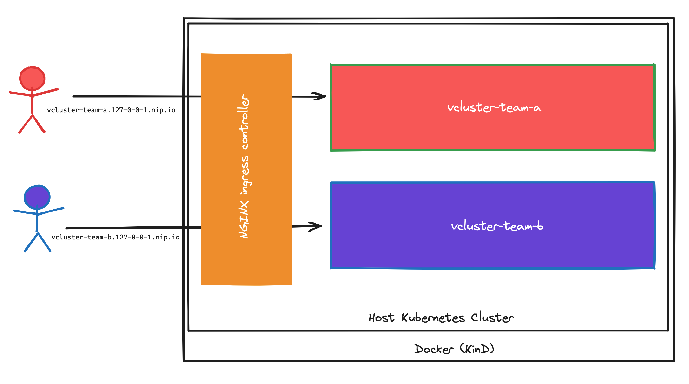

# Lab2 - Multitenancy with virtual clusters

## 1. Overview

After completing this lab you should have a good understanding on how to expose a virtual cluster's API server and how to make it accessible to specific people. This example should present the use case of splitting up a host cluster into multiple virtual clusters to provide e.g. each develop team it's own Kubernetes cluster. 

### Architecture



## 2. Prerequisites

### KinD

As already mentioned I am using KinD as a host cluster in all labs. Please follow the instructions on the [official documentation](https://kind.sigs.k8s.io/docs/user/quick-start/#installation) for the installation.
I am using following version in this lab.

**Command:**
```
kind --version
```

**Output:**
```
kind version 0.19.0
```

### kubectl

To interact with your Kubernetes clusters you need kubectl. Please follow the instructions on the [official documentation](https://kubernetes.io/docs/tasks/tools/) for the installation.

**Command:**
```
kubectl version --output=yaml
```

**Output:**
```
clientVersion:
  buildDate: "2023-04-14T13:14:41Z"
  compiler: gc
  gitCommit: 4c9411232e10168d7b050c49a1b59f6df9d7ea4b
  gitTreeState: clean
  gitVersion: v1.27.1
  goVersion: go1.20.3
  major: "1"
  minor: "27"
  platform: darwin/amd64
kustomizeVersion: v5.0.1
serverVersion:
  buildDate: "2023-05-12T19:03:40Z"
  compiler: gc
  gitCommit: 4c9411232e10168d7b050c49a1b59f6df9d7ea4b
  gitTreeState: clean
  gitVersion: v1.27.1
  goVersion: go1.20.3
  major: "1"
  minor: "27"
  platform: linux/amd64
```

### helm

This time, I try not to use the vcluster CLI, to give you another perspective on what is going on behind the curtain. I choose helm to maintain the virtual cluster, which makes the helm utility a prerequisite for this lab. For sure, you can use the vcluster CLI instead. Please follow the instructions on the [official documentation](https://helm.sh/docs/intro/install/) for the installation of helm. 

**Command:**
```
helm version
```
**Output:**
```
version.BuildInfo{Version:"v3.12.0", GitCommit:"c9f554d75773799f72ceef38c51210f1842a1dea", GitTreeState:"clean", GoVersion:"go1.20.4"}
```

### curl

I use curl for verifying the connections to the virtual clusters. Please follow the instructions on the [official documentation](https://everything.curl.dev/get) for the installation of curl.

**Command:**
```
curl --version
```
**Output:**
```
curl 7.88.1 (x86_64-apple-darwin22.0) libcurl/7.88.1 (SecureTransport) LibreSSL/3.3.6 zlib/1.2.11 nghttp2/1.51.0
Release-Date: 2023-02-20
Protocols: dict file ftp ftps gopher gophers http https imap imaps ldap ldaps mqtt pop3 pop3s rtsp smb smbs smtp smtps telnet tftp
Features: alt-svc AsynchDNS GSS-API HSTS HTTP2 HTTPS-proxy IPv6 Kerberos Largefile libz MultiSSL NTLM NTLM_WB SPNEGO SSL threadsafe UnixSockets
```
## 3. Create a KinD cluster

You find the KinD configuration for this lab [here](kind-config-vcluster-lab-2.yaml).

**Command:**
```
kind create cluster --config kind-config-vcluster-lab-2.yaml
```

After creating the KinD cluster, your kube config context should automatically switch to the new KinD cluster. If you are not using a KinD cluster, please change the context to your host cluster.

**Command:**
```
kubectl config current-context
```

**Output:**
```
kind-vcluster-host
```

## 4. Installing NGINX Ingress controller

In this lab I want to expose the virtual cluster's API server via [Kubernetes Ingress](https://kubernetes.io/docs/concepts/services-networking/ingress/), and as we are running a empty KinD cluster, which does not bring this functionality with it out of the box, we have to install a Ingress controller. I chose the NGINX Ingress controller for that. You find a very good explanation on how to use expose services running on KinD on the [kind documentation](https://kind.sigs.k8s.io/docs/user/ingress/). But if you follow the steps here, you should be fine. 

You can find the NGINX Ingress controller manifest in the resources directory. This is a copy from the [ingress-nginx Github website](https://raw.githubusercontent.com/kubernetes/ingress-nginx/main/deploy/static/provider/kind/deploy.yaml), with one modification. I want NGINX to enable SSL/TLS Passthrough. I need this feature, so that the TLS connection is terminated by the virtual cluster's API server and that the Certificate Authority of the Kubernetes service account we will use to connect is the correct one. Otherwise we would have troubles during TLS connection establishment and we would need to ignore the certificate verification. 

If you want to see the configuration of the NGINX Ingress controller, you can take a look at the manifest file.

**Command:**
```
grep "/nginx-ingress-controller" -B1 -A10 resources/nginx-ingress-on-kind.yaml
```

**Output:**
```
      - args:
        - /nginx-ingress-controller
        - --election-id=ingress-nginx-leader
        - --controller-class=k8s.io/ingress-nginx
        - --ingress-class=nginx
        - --configmap=$(POD_NAMESPACE)/ingress-nginx-controller
        - --validating-webhook=:8443
        - --validating-webhook-certificate=/usr/local/certificates/cert
        - --validating-webhook-key=/usr/local/certificates/key
        - --watch-ingress-without-class=true
        - --publish-status-address=localhost
        - --enable-ssl-passthrough=true
```

Let's deploy the NGINX Ingress controller.

**Command:**
```
kubectl apply -f resources/nginx-ingress-on-kind.yaml
```
**Output:**
```
namespace/ingress-nginx created
serviceaccount/ingress-nginx created
serviceaccount/ingress-nginx-admission created
role.rbac.authorization.k8s.io/ingress-nginx created
role.rbac.authorization.k8s.io/ingress-nginx-admission created
clusterrole.rbac.authorization.k8s.io/ingress-nginx created
clusterrole.rbac.authorization.k8s.io/ingress-nginx-admission created
rolebinding.rbac.authorization.k8s.io/ingress-nginx created
rolebinding.rbac.authorization.k8s.io/ingress-nginx-admission created
clusterrolebinding.rbac.authorization.k8s.io/ingress-nginx created
clusterrolebinding.rbac.authorization.k8s.io/ingress-nginx-admission created
configmap/ingress-nginx-controller created
service/ingress-nginx-controller created
service/ingress-nginx-controller-admission created
deployment.apps/ingress-nginx-controller created
job.batch/ingress-nginx-admission-create created
job.batch/ingress-nginx-admission-patch created
ingressclass.networking.k8s.io/nginx created
validatingwebhookconfiguration.admissionregistration.k8s.io/ingress-nginx-admission created
```

It will take some time to come up, you can use this command to verify/wait until it is fully working.

**Command:**
```
kubectl wait --namespace ingress-nginx \
  --for=condition=ready pod \
  --selector=app.kubernetes.io/component=controller \
  --timeout=90s
```

**Output:**
```
pod/ingress-nginx-controller-5bb6b499dc-css5z condition met
```

One part of this installation is the Ingress class we will use in our Ingress resources. 

**Command:**
```
kubectl get ingressclasses.networking.k8s.io
```

**Output:**
```
NAME    CONTROLLER             PARAMETERS   AGE
nginx   k8s.io/ingress-nginx   <none>       21s
```

The NGINX Ingress controller should now be up and working and we can proceed with the deployment of our first virtual cluster. 

## 5. Deploy vcluster with helm

I am using the offical virtual cluster helm chart to deploy our virtual clusters. At first I need to add the new helm chart repository to be able to fetch the helm chart afterwards.

**Command:**
```
helm repo add loft-sh https://charts.loft.sh
```

**Output:**
```
"loft-sh" has been added to your repositories
```

I can see quite some helm charts in this repository, as the virtual cluster helm charts are provided by the company [Loft](https://loft.sh/). For this tutorial important are the 3 following charts:
* vcluster and vcluster-k3s: Virtual cluster installation using the [K3s](https://k3s.io/) project
* vcluster-k0s: Virtual cluster installation using the [K0s Kubernetes distribution](https://k0sproject.io/)
* vcluster-k8s: virtual cluster installation using the full blown [Kubernetes](https://kubernetes.io/) project

Depending on your use case, you can decide which type of Kubernetes cluster installation you want. In this lab we are using again the K3s helm chart.  

**Command:**
```
helm search repo vcluster
```

**Output:**
```
NAME                                	CHART VERSION	APP VERSION	DESCRIPTION
loft-sh/vcluster                    	0.15.2       	           	vcluster - Virtual Kubernetes Clusters
loft-sh/vcluster-eks                	0.15.2       	           	vcluster - Virtual Kubernetes Clusters (eks)
loft-sh/vcluster-k0s                	0.15.2       	           	vcluster - Virtual Kubernetes Clusters (k0s)
loft-sh/vcluster-k8s                	0.15.2       	           	vcluster - Virtual Kubernetes Clusters (k8s)
loft-sh/vcluster-pro                	0.1.0        	           	vcluster-pro - Virtual Kubernetes Clusters
loft-sh/vcluster-pro-eks            	0.1.0        	           	vcluster-pro - Virtual Kubernetes Clusters (eks)
loft-sh/vcluster-pro-k0s            	0.1.0        	           	vcluster-pro - Virtual Kubernetes Clusters (k0s)
loft-sh/vcluster-pro-k8s            	0.1.0        	           	vcluster-pro - Virtual Kubernetes Clusters (k8s)
loft-sh/jspolicy                    	0.2.2        	           	JavaScript Policies for Kubernetes
loft-sh/loft                        	3.2.0        	           	Secure Cluster Sharing, Self-Service Namespace ...
loft-sh/loft-agent                  	3.2.0        	           	Loft Cluster Agent
loft-sh/loft-direct-cluster-endpoint	1.14.0       	           	Direct Secure Cluster Loft Access Point
```

Right now I will not modify/add helm values, so I will rely on the default values. But, as you will see, I need to change them later. Your first virtual cluster is for Team A. 

**Command:**
```
helm install --create-namespace vcluster-team-a loft-sh/vcluster -n team-a --version 0.15.2
```

**Output:**
```
NAME: vcluster-team-a
LAST DEPLOYED: Fri Jun 30 09:00:13 2023
NAMESPACE: team-a
STATUS: deployed
REVISION: 1
TEST SUITE: None
NOTES:
Thank you for installing vcluster.

Your vcluster is named vcluster-team-a in namespace team-a.

To connect to the vcluster, use vcluster CLI (https://www.vcluster.com/docs/getting-started/setup):
  $ vcluster connect vcluster-team-a -n team-a
  $ vcluster connect vcluster-team-a -n team-a -- kubectl get ns


For more information, please take a look at the vcluster docs at https://www.vcluster.com/docs
```

After deploying the virtual cluster, let's verify the installation.

**Command:**
```
helm ls -A
```

**Output:**
```
NAME           	NAMESPACE	REVISION	UPDATED                              	STATUS  	CHART          	APP VERSION
vcluster-team-a	team-a   	1       	2023-06-30 09:00:13.887225 +0200 CEST	deployed	vcluster-0.15.2
```

As already mentioned in this lab I try not using the vcluster CLI. So I need another way to connect to the virtual cluster. The vcluster CLI is just a utility without any knowledge about the installation. In the background I always connects to the Kubernetes API server and fetches information for you, to make it easy to interact with virtual clusters. So everything you do with the vcluster CLI, can be done the hard way too. Take a look at the secrets in the team-a namespace.

**Command:**
```
kubectl get secrets -n team-a vc-vcluster-team-a -o yaml
```

**Output:**
```
apiVersion: v1
data:
  certificate-authority:
    --output omitted--
  client-certificate:
    --output omitted--
  client-key:
    --output omitted--
  config:
    --output omitted--
kind: Secret
metadata:
  creationTimestamp: "2023-06-30T07:00:27Z"
  name: vc-vcluster-team-a
  namespace: team-a
  ownerReferences:
  - apiVersion: v1
    controller: false
    kind: Service
    name: vcluster-team-a
    uid: bc7fee8d-d6b1-4870-beda-b0ed97d32590
  resourceVersion: "4070"
  uid: a4624d7b-7b04-4ac6-9de4-35e4bf4d6a32
type: Opaque
```

For every virtual cluster, by default, a secret is created in the virtual clusters namespace, starting with *vc-* and the virtual cluster name. 

### Questions
1. Take a look at the content of your secret. What do you see? Take a look at the certificates (you can use openssl for that).
2. Take a deeper look at the item *config*! What does it contain?

## 6. Connecting to the virtual cluster

When I decode the *config* item of the secret, I see a complete kube-config for my virtual cluster. So I can extrace it and use it as my kube-config. 

**Command:**
```
kubectl get secrets vc-vcluster-team-a -n team-a -o jsonpath="{.data.config}" | base64 -d
```

**Output:**
```
apiVersion: v1
clusters:
- cluster:
    certificate-authority-data:
      --output omitted--
    server: https://localhost:8443
  name: my-vcluster
contexts:
- context:
    cluster: my-vcluster
    namespace: default
    user: my-vcluster
  name: my-vcluster
current-context: my-vcluster
kind: Config
preferences: {}
users:
- name: my-vcluster
  user:
    client-certificate-data:
      --output omitted--
    client-key-data:
      --output omitted--
```

**Command:**
```
kubectl get secrets vc-vcluster-team-a -n team-a -o jsonpath="{.data.config}" | base64 -d > kubeconfig.yaml
export KUBECONFIG="./kubeconfig.yaml"
kubectl config get-contexts
```
**Output:**
```
CURRENT   NAME          CLUSTER       AUTHINFO      NAMESPACE
*         my-vcluster   my-vcluster   my-vcluster   default
```

**Command:**
```
kubectl get namespaces
```
**Output:**
```
E0706 11:31:56.967171   13555 memcache.go:265] couldn't get current server API group list: Get "https://localhost:8443/api?timeout=32s": dial tcp [::1]:8443: connect: connection refused
E0706 11:31:56.967873   13555 memcache.go:265] couldn't get current server API group list: Get "https://localhost:8443/api?timeout=32s": dial tcp [::1]:8443: connect: connection refused
E0706 11:31:56.968868   13555 memcache.go:265] couldn't get current server API group list: Get "https://localhost:8443/api?timeout=32s": dial tcp [::1]:8443: connect: connection refused
E0706 11:31:56.969878   13555 memcache.go:265] couldn't get current server API group list: Get "https://localhost:8443/api?timeout=32s": dial tcp [::1]:8443: connect: connection refused
E0706 11:31:56.970960   13555 memcache.go:265] couldn't get current server API group list: Get "https://localhost:8443/api?timeout=32s": dial tcp [::1]:8443: connect: connection refused
The connection to the server localhost:8443 was refused - did you specify the right host or port?
```

### Questions
1. Why can we not connect to the vcluster? Where is the problem here?
2. Why is the connection to the vcluster working, when using the vcluster CLI?

## 7. Create a ingress resource for the virtual cluster

As you figured already figured out, we are facing two issues here. At first, the server address in the kubeconfig is localhost, which works when using the vcluster CLI, because it is using port-forwarding to redirect us to the virtual clusters API server, but in our case, we want to access the API from outside. And second, the did not created a ingress resource for the virtual clusters to expose the API server. Let's create a ingress for team A's virtual cluster. 

To proceed we need to remove the KUBECONFIG environment variable. 

**Command:**
```
unset KUBECONFIG
```

**Command:**
```
kubectl apply -f resources/vcluster-team-a.ingress.yaml
```
**Output:**
```
ingress.networking.k8s.io/vcluster-team-a created
```

When exposing a service via Ingress you should define a hostname (Host-based Routing). In our case, as we run this locally on a workstation, we use the DNS service from [nip.io](nip.io).

**Command:**
```
grep host resources/vcluster-team-a.ingress.yaml
```

**Output:**
```
  - host: vcluster-team-a.127-0-0-1.nip.io
```

It should resolve this hostname to 127.0.0.1, which is the workstation again. 

**Command:**
```
dig +short  vcluster-team-a.127-0-0-1.nip.io
```

**Output:**
```
127.0.0.1
```

If you are questioning now, how this works, it is easily explained. The KinD configuration already includes additional port mappings for the ports 80 and 443. So if you connect to localhost on port 80, you will connect to the KinD cluster. Please conside to use different ports if you are either not able to use port 80 and/or 443. In this case, you will need to rewrite the KinD configuration.

**Command:**
```
kubectl get ingress -n team-a
```

**Output:**
```
NAME              CLASS   HOSTS                              ADDRESS     PORTS   AGE
vcluster-team-a   nginx   vcluster-team-a.127-0-0-1.nip.io   localhost   80      2m59s
```

Now the virtual cluster for Team A is exposed, but we cannot connect to it yet. The certificate of the vcluster is not correct, because we want to connect with *vcluster-team-a.127-0-0-1.nip.io*. Let's deploy the virtual cluster again with additional settings. 

**Command:**
```
helm uninstall vcluster-team-a -n team-a
```

**Output:**
```
release "vcluster-team-a" uninstalled
```

**Command:**
```
helm install vcluster-team-a loft-sh/vcluster -n team-a --version 0.15.2 --values resources/vcluster-team-a.helm-values.yaml
```

**Output:**
```
NAME: vcluster-team-a
LAST DEPLOYED: Mon Jul  3 13:02:12 2023
NAMESPACE: team-a
STATUS: deployed
REVISION: 1
TEST SUITE: None
NOTES:
Thank you for installing vcluster.

Your vcluster is named vcluster-team-a in namespace team-a.

To connect to the vcluster, use vcluster CLI (https://www.vcluster.com/docs/getting-started/setup):
  $ vcluster connect vcluster-team-a -n team-a
  $ vcluster connect vcluster-team-a -n team-a -- kubectl get ns


For more information, please take a look at the vcluster docs at https://www.vcluster.com/docs
```

I added 2 values to here:
1. A kube-config context name for more visability
2. A TLS SAN (Subject Alternative Name) to be able to establish a secure TLS connection

**Command:**
```
cat resources/vcluster-team-a.helm-values.yaml
```

**Output:**
```
syncer:
  kubeConfigContextName: "vcluster-team-a"
  extraArgs:
  - --tls-san=vcluster-team-a.127-0-0-1.nip.io
```

To test if the connection is working, I start with [curl](https://curl.se/). This is an optional step, only for verification. 

**Command:**
```
curl --insecure https://vcluster-team-a.127-0-0-1.nip.io
```
**Output**
```
{
  "kind": "Status",
  "apiVersion": "v1",
  "metadata": {},
  "status": "Failure",
  "message": "forbidden: User \"system:anonymous\" cannot get path \"/\"",
  "reason": "Forbidden",
  "details": {},
  "code": 403
}%
```

I still need to use the insecure flag here, because my workstation does not trust the virtual clusters certificate. *kubectl* will trust it, because the CA public certificate is part of the kube-config. Right now we are getting a HTTP [403](https://developer.mozilla.org/en-US/docs/Web/HTTP/Status/403) error. This is fine too, because the API server does not allow anonymous access. 


I need now the repeat the same steps like in the last section to fetch the kube-config. 

**Command:**
```
kubectl get secrets vc-vcluster-team-a -n team-a -o jsonpath="{.data.config}" | base64 -d > kubeconfig.yaml
export KUBECONFIG=./kubeconfig.yaml
```

### Questions
1. Is the connection now working? What did we forgot?

With the helm chart is is not possible, at least not right now, to set the server in the kube-config. We have to adapt it manually.

**Command:**
```
kubectl config set-cluster vcluster-team-a --server=https://vcluster-team-a.127-0-0-1.nip.io
```

**Output:**
```
Cluster "vcluster-team-a" set.
```

And now it is finally working as expected.
**Command:**
```
kubectl get namespaces
```

**Output:**
```
NAME              STATUS   AGE
default           Active   3h18m
kube-system       Active   3h18m
kube-public       Active   3h18m
kube-node-lease   Active   3h18m
```

### Additional Tasks
1. Create a virtual cluster for Team B. 
2. Expose the virtual cluster for Team B and verify the connectivity.
3. Create one combined kube-config file, to make it possible to jump between contexts easily. 

## 8. Bonus 1: Create a Service Account for Team A virtual cluster

As this tasks is not related to virtual clusters, it is a bonus for this lab. So if you want to spend some more time on working with Kubernetes Service Account, be my guest. 

After jumping to the vcluster-team-a context, create a Service Account and it's necassary RBAC configuration. 

**Command**
```
kubectl create serviceaccount team-a-read-only -n kube-system
```

**Outputs:**
```
serviceaccount/team-a-read-only created
```

We will give this Service Account *get*, *list* and *watch* permissions on all resources of this cluster. Please be aware that this is only an example configuration and does not follow the [principle of least privilege](https://en.wikipedia.org/wiki/Principle_of_least_privilege).

**Command:**
```
kubectl create clusterrole cluster-read-only --verb=get --verb=list --verb=watch --resource="*"
```
**Output:**
```
clusterrole.rbac.authorization.k8s.io/cluster-read-only created
```

**Command:**
```
kubectl create clusterrolebinding team-a-read-only --clusterrole cluster-read-only --serviceaccount kube-system:team-a-read-only
```

**Output:**
```
clusterrolebinding.rbac.authorization.k8s.io/team-a-read-only created
```

I use *curl* again to verify the connection. To authenticate to the Kubernetes API server, I will use a JWT token, created for this Service Account.  

**Command:**
```
kubectl create token team-a-read-only -n kube-system
```
**Command:**
```
curl --silent --insecure https://vcluster-team-a.127-0-0-1.nip.io/api/v1/namespaces --header "Authorization: Bearer --output omitted-- | jq -rM '.items[].metadata.name'
```

**Output:**
```
default
kube-system
kube-public
kube-node-lease
```

### Additional tasks
1. For sure you can use kubectl to connect to the virtual cluster. Either adapt the current context or create an additional context to connect with the team-a-read-only Service Account.

## 8. Bonus 2: Use Metallb to expose the virtual cluster's API server

One of the easiest way to expose a Kubernetes Service on a managed cluster, e.g. EKS, GKE, AKS, is to use a Service with the type *LoadBalancer*. This type of service is normally detected by a custom Kubernetes Controller and the Cloud Provider takes care about either creating or configuring a Load Balancer in the Cloud Provider's infrastructure. The only thing you see is an external IP address in the status of the Service resource. You can find more information about that on the [official Kubernetes documentation](https://kubernetes.io/docs/concepts/services-networking/service/). 

Metallb is a load-balancer implementation for bare metal Kubernetes clusters, and can be used in a KinD setup too. But I have to warn you, the complexity of this setup is quite high, because it is error-prone. To access the virtual clusters API server, you need to create a Service resource with the type *LoadBalancer*. This will use by default a NodePort, a port on the node assigned to your Service. This port needs to be opened on the Docker container too. This chain of ports need to fix:
* Opened port on the pod
* Port and Target Port on the Service
* NodePort on the Service
* Port and ContainerPort in the KinD configuration

If there is one error in this chain, the connection will not work. I provide you here one working way, but as this setup has nothing to do with virtual clusters, this is bonus work.

At first I need to install Metallb.
**Command:**
```
kubectl apply -f resources/metallb-on-kind.yaml
```

**Output:**
```
namespace/metallb-system created
customresourcedefinition.apiextensions.k8s.io/addresspools.metallb.io created
customresourcedefinition.apiextensions.k8s.io/bfdprofiles.metallb.io created
customresourcedefinition.apiextensions.k8s.io/bgpadvertisements.metallb.io created
customresourcedefinition.apiextensions.k8s.io/bgppeers.metallb.io created
customresourcedefinition.apiextensions.k8s.io/communities.metallb.io created
customresourcedefinition.apiextensions.k8s.io/ipaddresspools.metallb.io created
customresourcedefinition.apiextensions.k8s.io/l2advertisements.metallb.io created
serviceaccount/controller created
serviceaccount/speaker created
role.rbac.authorization.k8s.io/controller created
role.rbac.authorization.k8s.io/pod-lister created
clusterrole.rbac.authorization.k8s.io/metallb-system:controller created
clusterrole.rbac.authorization.k8s.io/metallb-system:speaker created
rolebinding.rbac.authorization.k8s.io/controller created
rolebinding.rbac.authorization.k8s.io/pod-lister created
clusterrolebinding.rbac.authorization.k8s.io/metallb-system:controller created
clusterrolebinding.rbac.authorization.k8s.io/metallb-system:speaker created
secret/webhook-server-cert created
service/webhook-service created
deployment.apps/controller created
daemonset.apps/speaker created
validatingwebhookconfiguration.admissionregistration.k8s.io/metallb-webhook-configuration created
```

Metallb spins up quiet fast, but to verify if it is ready, you can use this command.

**Command:**
```
kubectl wait --namespace metallb-system \
                --for=condition=ready pod \
                --selector=app=metallb \
                --timeout=90s
```
**Output:**
```
pod/controller-789c75c689-lf8qr condition met
```

I will run a easy [L2 setup](https://metallb.universe.tf/configuration/). Therefore I need to see which Address Range is used by my docker installation. This is needed for the Metallb address pool confniguration.

**Command:**
```
docker network inspect -f '{{.IPAM.Config}}' kind
```

**Output:**
```
[{172.18.0.0/16  172.18.0.1 map[]} {fc00:f853:ccd:e793::/64   map[]}]
```

If you have a different network on your workstation, you need to modify the address range in the manifest first, before apllying it. 

**Command:**
```
k apply -f resources/metallb-addresspool.yaml
```

**Output:**
```
ipaddresspool.metallb.io/addresspool1 created
l2advertisement.metallb.io/empty created
```

To test if Metallb is working, I create a new service resource.

**Command:**
```
kubectl create service loadbalancer test-metallb -n team-b --tcp 443
```
**Output:**
```
service/vcluster-team-b created
```

Now you can see that Metallb is providing a IP address for the newly created Service resource. You can delete this Service resource and deploy a new virtual cluster. The helm chart provides the option to deploy a Service Object of the type *LoadBalancer* for the vcluster. But to make it work, you will need the extra port mapping in the KinD configuration. Happy hacking!

**Command:**
```
kubectl get svc -n team-b
```

**Output:**
```
NAME            TYPE           CLUSTER-IP     EXTERNAL-IP      PORT(S)         AGE
test-metallb    LoadBalancer   10.106.94.50   172.18.255.200   443:31860/TCP   9s
```

## 9. Cleanup

Delete at first the virtual clusters by using helm.

**Command:**
```
helm uninstall vcluster-team-a -n team-a
```

**Output:**
```
release "vcluster-team-a" uninstalled
```

**Command:**
```
helm uninstall vcluster-team-b -n team-b
```

**Output:**
```
release "vcluster-team-b" uninstalled
```

And then delete the KinD cluster.

**Command**
```
kind delete cluster --name vcluster-host
```

**Output**
```
Deleting cluster "vcluster-host" ...
Deleted nodes: ["vcluster-host-control-plane"]
```
